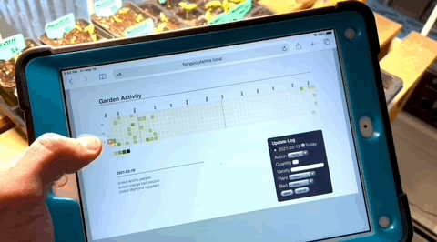

# Garden

A simple garden log visualized as a contribution graph.  A Github profile for
your plants.



## Installing

Clone this repo on your favorite webserver, desginate a PostgreSQL database,
and execute the install make target.

```bash
PGUSER=joshb PGDATABASE=fishpoopfarms make install
```

### Docker Installation

You will need to edit the .env file for postgres container to use.

From a terminal run `docker-compose up` where the docker-compose.yml is located.  Visual Studio users can right-click the docker-compose.yml and to bring the app up.

Note the src/ directory is synced to the webserver so there is no need to relaunch containers during development to test changes.

<br>

#### Multiple Domains

To map the server_name in the site.conf file, linux users will want to add entries to their `/etc/hosts` file.
 Windows users can edit
`C:\Windows\System32\drivers\etc\hosts` to modify dns.

```
127.0.0.1 fishpoopfarm5.com
127.0.0.1 fishpoopfarm7.com
127.0.0.1 fishpoopfarm8.com
```

Note the hosts defined here must match the `site.conf` defined server_name.

## Authors

* **Josh Byard** - *Initial work* - [jbyard](https://github.com/jbyard)
* **Austin Brooks** - *Docker work* - [brookcliff](https://github.com/brookcliff)
